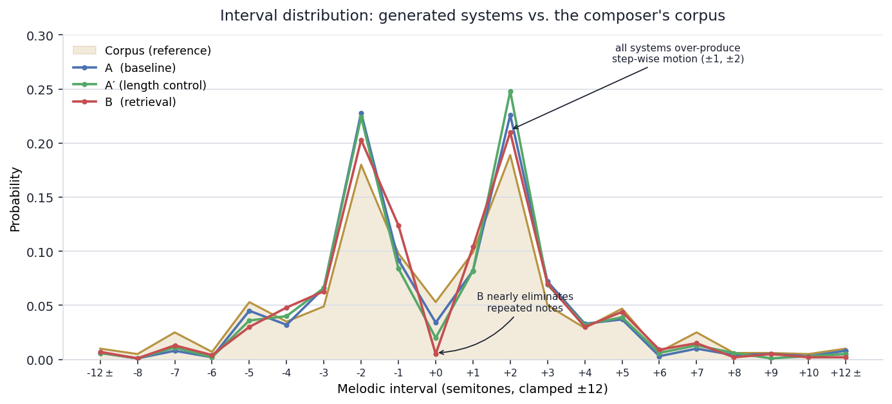
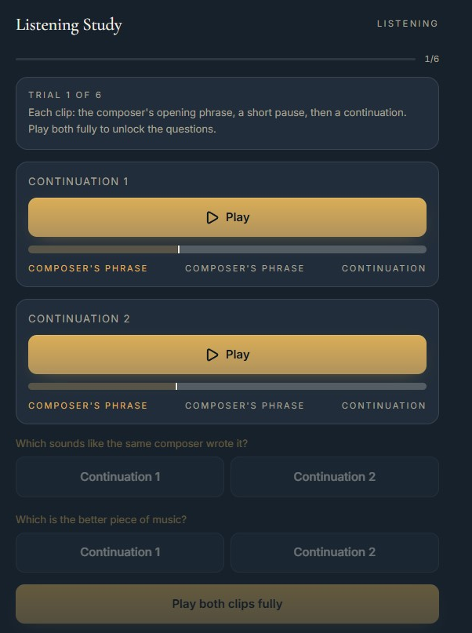

# Personal-Style Symbolic Music Generation with Retrieval Augmentation

With just a brief background in computer science, and an extensive one in music, I wanted to combine my interests and learn about machine learning and GPTs, which led to my intrigue in this project. The purpose of this project was to fine-tune an [Anticipatory Music Transformer](https://crfm.stanford.edu/2023/06/16/anticipatory-music-transformer.html) on a personal \~46-piece catalogue to continue melodic phrases in my compositional style, then test whether retrieval augmentation (RAG) from my own corpus improves on a length-matched control. Overall it was a 4-week research project bookended by a week of setup and one of wrap-up.

## Result

**Retrieval did not improve on the control.** Across three objective metrics (each against five corpus-reference constructions) and a blinded two-axis listening study (15 participants, 108 judgements), every estimate favored the length-matched control A′ over the retrieval system B; no listening-test difference was significant. p being a metric of how well pure chance explains results, low p meaning chance explains it poorly, the style metric p was 11%, and the quality one was 6.4%, both consistent with no reliable preference. Prepending corpus material (offsetting where generation starts from but not including in the final trimmed clip) *did* improve stylistic fidelity (A→A′), context quantity mattered more than relevance. The measured mechanism: octave-only alignment leaves retrieved phrases in a foreign key 84% of the time.

See `docs/project_plan_5.md` for the full writeup and `docs/session_summary_week*.md` for the week-by-week narrative.

## The three systems

- **A** — LoRA-fine-tuned AMT, seed only.  
- **A′** — random train chunks prepended (length-matched control).  
- **B** — retrieved similar chunks prepended (the RAG system).

The research question and study was focused around the comparison of **A′ vs B** (A' chosen over A to solve issue of B starting later in the generation window than A, which would create an uneven comparison due to how training the model works).

## Setup

- Ubuntu (WSL of choice)  
- 46 piece corpus (stripped for melody tracks only using roster-walk and chunked and tokenized for model processing)  
- Python **3.11** in a venv (`transformers==4.29.2` pins `tokenizers==0.13.3`, which has no 3.12 wheel).  
- `pip install -r requirements.txt` 
- The `anticipation` package is installed from its GitHub repo, **not** PyPI.  
- GPU: RTX 4090 / CUDA cu124  
- Lovable used for research study (gathering data on headline question of A' vs. B)

## Data

I've chosen not to include the raw catalogue (49 pieces, 3 excluded for this first pass) as they are my personal compositions and the sheer size of the data (\~250Mb) seemed unreasonable to dump. However, you can use these tools to create your own stylized continuations given a large .MID library yourself.

## Pipeline (run in order)

**Week 1 — data pipeline** `routing.py` → `harvest.py`/`batch_harvest.py` → `chunk.py`/`batch_chunk.py` → `augment.py` → `split.py`  \>\> melody extraction → chunk → augment → split

Took the complete corpus and turned multi-track midi files into individual ones that were searched for melody using a roster processing system. Those full tracks were chunked into 15s pieces (with a 7.5s delay to create a second set of chunks for more tuning data). Chunks were augmented to 12x data by moving them up and down 6 semitones (the model is being taught melody shapes not explicit note combos, it's transposition invariant). Using a seed (set once, never touched for the rest of the project) pieces were split into training and evaluation.

**Week 2 — fine-tune** `tokenize_corpus.py` → `packer.py` → `train.py` / `train_lora.py`  \>\> tokenize → pack into 2048 token strings → train models

The training and evaluation datasets were tokenized (transformers don't read midi, they read from their own token library language), and packed (2048 slots in a token string, with bookend tokens needed to indicate start and stop). These were fed into a basic training setup, and then a lora one (the step size and full augmentation of the first pass led to only one epoch of training happening, as opposed to the 8 of the lora model)

**Week 3 — retrieval** `features.py` → `build_index.py` → `retrieve.py` → `condition.py` → `seeds.py` → `generate_ab.py`  \>\> built 35d similarity vector → build index of clips for RAG to choose from → cosine similarity to find closest clips to seed clips (max one per piece) → align and augment data for proper RAG setup → choose a set of 20 random seeds from val → generate clips from pretrained and RAG

To summarize musical similarity, several metrics were chosen (interval \+ duration \+ contour) as representative quantities to form a 35 dimensional vector that is used for cosine similarity (finding the closest vector to assist RAG in finding relevant material). Because there aren't that many pieces for cosine similarity to choose from, a cap of 1 retrieved clip per piece was implemented. With 20 seeds chosen from val (all checked for real content in them, no 2 note phrases), continuations from all three systems were generated for evaluation in the next week. 

**Week 4 — evaluation** `run_metrics.py` (histograms \+ 5-reference sensitivity), `novelty.py`/`novelty_stage2.py`, `check_key_drift.py`, `select_clips.py` → `render_audio.py` → `manifest_paired.py`, then `wilcoxon_ab.py`  \>\> histogram, pitch class, and novelty checks → select and render clips for trials → create manifest for external app → wilcoxon checks on research data

Various metrics ran like Interval distribution (what percentage of each interval appears in each system), novelty (is RAG copying verbatim from its retrieved content), and key drift (how often do the models generate a continuation in a different key than the seed). For research, I created a Lovable app to collect data on participant preference for one model over the other (A' vs. B). Wilcoxon checks (looking at the data to gauge per participants preference by magnitude and direction) were applied to find end results: RAG neither hurts nor helps generation.

## Gotchas (read before re-running)

- **Tokenizer is married to the base model** — use `anticipation`'s `midi_to_events`, never MidiTok. A different tokenizer → the model reads noise.  
- **`generate` returns the whole stream** — always clip to `t > start_time`.  
- **Analyze per-seed, never pool raw** — pooled rates are dominated by their worst member (bit us four times).  
- **Re-render → rebuild manifest → redeploy, in that order** — durations are embedded at build time; a stale manifest makes playback bars race.  
- **Keys are private** — `PAIRING_KEY.json` maps listening-study slots to systems and is gitignored. The public data reveals nothing without it.

## Repo layout

All useful scripts and resources in .src. Extra debug and testing scripts included in the other folders. Docs has the extra, week-by-week documentation. [`listening-study/`](https://github.com/rock-robot/listening-study) is a separate repo.

## Not included

Model weights (`checkpoints/`) and the audio corpus, `venv311/`. Running `train_lora.py` after following the week one pipeline with your own data lets you generate your own model weights.  
